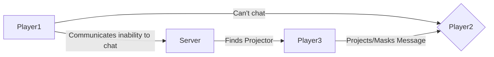

# Features
All the following features can be enabled/disabled. If you want to change features, please read the [API Configuration Properties Section](api.md#configuration-properties) for further information on how to do so.

---

## Chat Filtering
!!! danger
    Disabling this will fully deactivate any filtering and almost certainly get your game in trouble!
Filters chat messages. That's all

---

## Utilities
### QuickChat System
Lets all Players communicate with eachother using premade Text messages. Technically this should not break the new Roblox Content Sharing policies.

---

## Join/Leave Messages
Announces if a player joined and vice versa.

---

## Projection System
!!! danger
    This could potentially get your game in trouble.
The Projection system enables players to communicate with eachother via custom chat messages, even though they wouldn't normally be able to due to account settings.
For the Projection system to work, a projector in form of another player in the same game server is required. This projector needs to be able to chat and will automatically be selected when this feature is enabled.

---

## Anti Spam System
This is a system that prevents players from spamming the chat. Highly customizable.

---

## User Chatting Compatibility Check
This ensures that chatting between users is permitted to comply with Roblox ToS. If it is not, then custom chat messages can not be sent between these players.

---

## Chat Cache
!!! danger
    This could potentially get your game in trouble.
Ever wanted to read previous messages in the chat before you joined the game server? The Chat Cache system loads previous messages into the chat of newly joined players.